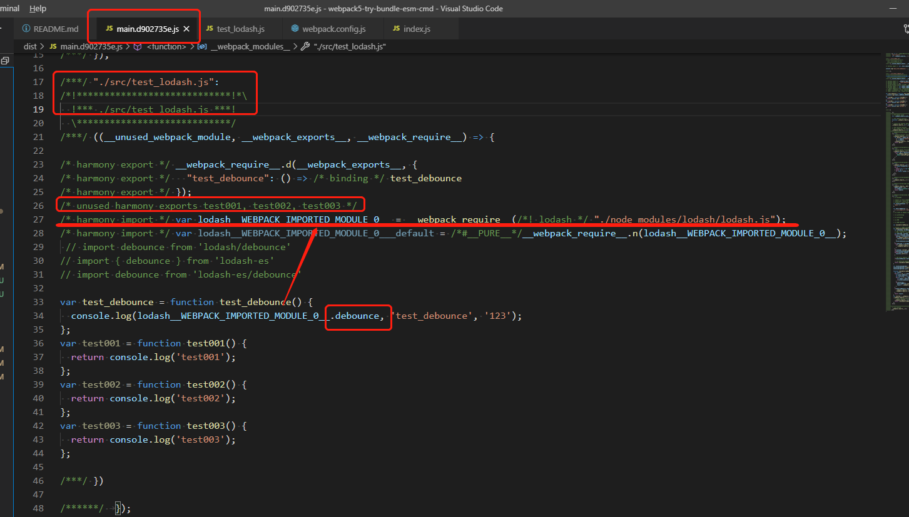
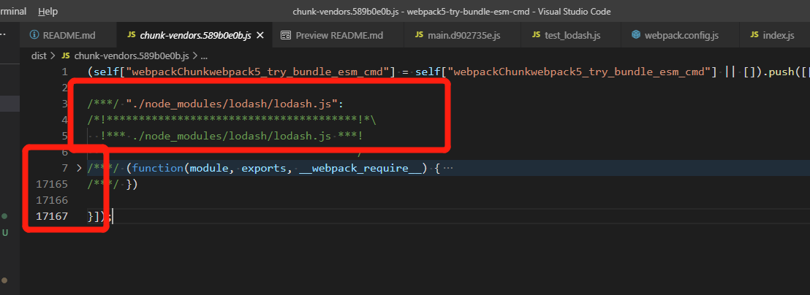
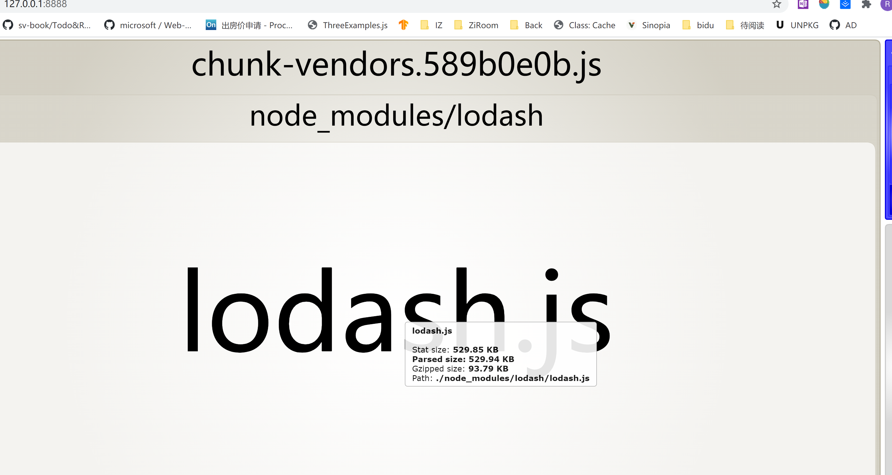
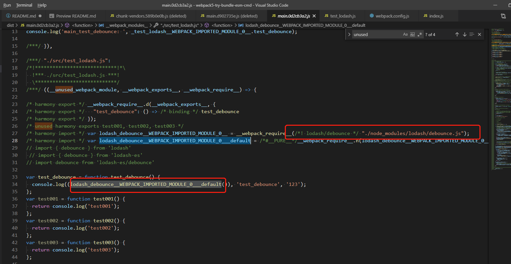
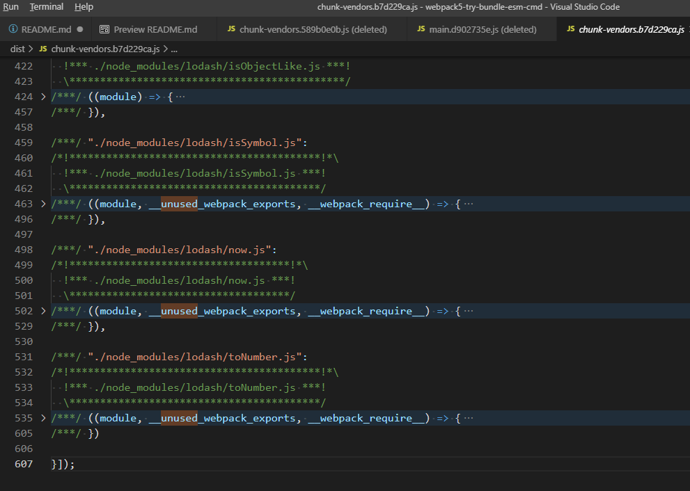
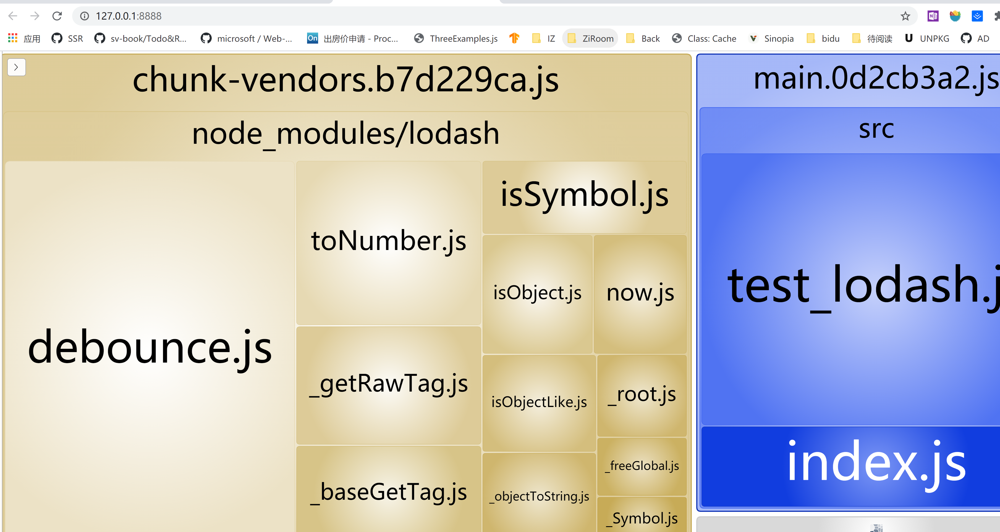
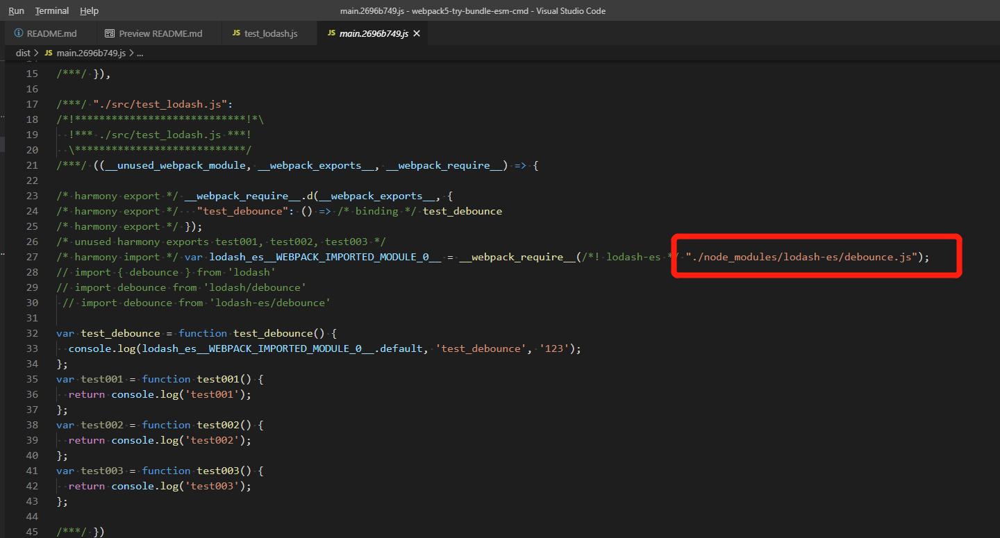
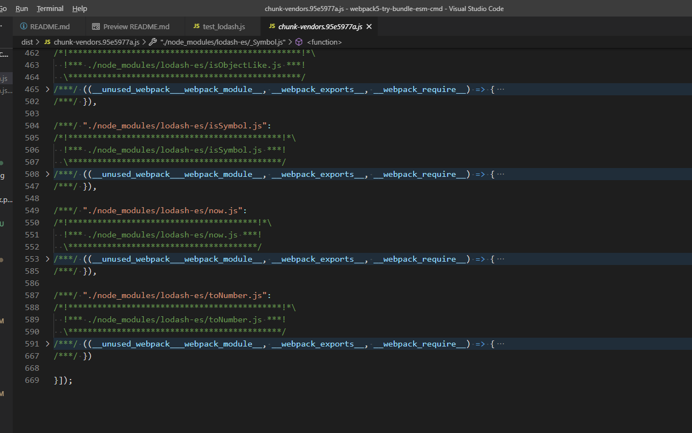
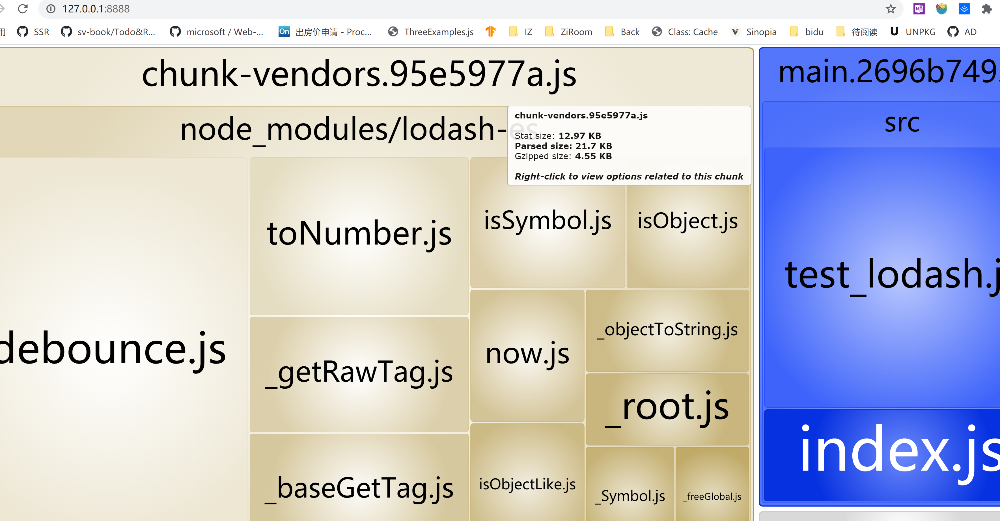
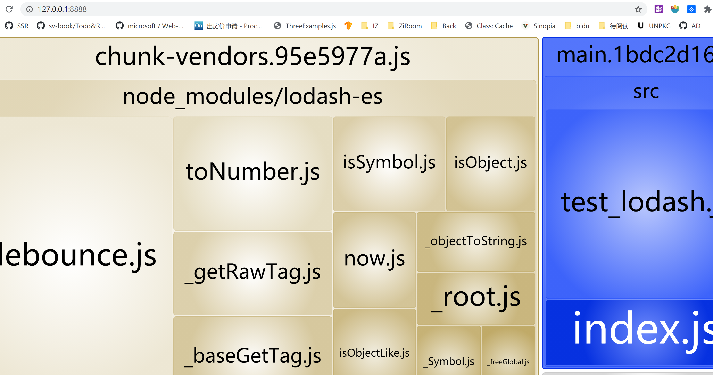

# webpack5 vs webpack4: bundle-esm-cmd

1. 分析webpack5打包文件代码，查看cmd、esm打包区别。    
2. lodash和lodash-es正好作为实验对象。     
3. 对比webpack4 与 webpack5的bundle文件差异     

#  webpack5 按照webpack4实验方式来操作
## 🙄 Target
1. 分析webpack5打包文件代码，查看cmd、esm打包区别。
2. lodash和lodash-es正好作为实验对象；lodash最佳使用推荐，以及推荐理由(通过bundle代码角度)

-----------------            

## 🤔 Try 多场景
> 😘Try000 `cmd`: 全引入lodash，`import { debounce } from 'lodash'`
>> `main.js`中依然引入的是整个`lodash.js`文件      
>> `chunk-vendors`中近`2w`行的lodash代码, 且没有`ununsed harmony`标识，意味着不会被shaking掉       

-------------       

> 😘Try001 cmd: 全路径引入lodash/debounce，`import debounce from 'lodash/debounce'`
>> `main.js`中引入的是`lodash/debounce`文件,对比Try000，仅引入了相关代码      
>> `chunk-vendors`中近`600`行的lodash代码, 且没有`ununsed harmony`标识，意味着不会被shaking掉       
>> lodash的打包代码量明显减小：`2w->600` 🤙🏻 🤙🏻 🤙🏻

-------------    

> 😘 Try010 esm: 全引入lodash，`import { debounce } from 'lodash-es'`
>> `main.js` 中会引入的是`我靠，直接引用的lodash-es/debounce.js`    🐮🐮🐮`跟webapck4不一样哦`       
>> `chunk-vendors`中近`600`行的lodash代码，已经shaking了

-------------      

> 😘 Try011 esm: 全路径引入lodash，`import debounce from 'lodash-es/debounce'`
>> `main.js` 中会引入的是`lodash-es/debounce.js`  
>> `chunk-vendors`中近`600`行的lodash代码，已经shaking了

------------      

## 来看一下
> webpack5 & webpack4 对`commonjs`下的`all in` 和 `full path` 的打包文件的引入无太大差异
>> `import { debounce } from 'lodash'` 引入整个lodash文件，没有`unused***`的标识，不会shaking掉      
>> `import debounce from 'lodash/debounce'`引入debounce文件&相关文件，没有`unused***`的标识，不会shaking掉       

> webpack5 & webpack4 对`es Module`下的`all in` 和 `full path` 的打包文件的引入有点差别
>> `import { debounce } from 'lodash-es'`     
>>> webpack4 引入这个`lodash-es`文件，然后标记非`debounce`相关为`unused***`，后续可进行shading       
>>> webpack5 直接引入了`lodash-es/debounce`文件         

>> `import debounce from 'lodash-es/debounce'`引入debounce文件&相关文件，没有`unused***`的标识，不会shaking掉       

# 那么webpack5 对cmd的优化是骗人的？   自己写的esm方法呢， 自己写的commonjs方法呢，一会儿可以作为佐证实验一下